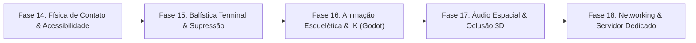

# 🗺️ Arena Blockout Limited — Matriz Completa de Features & Roadmap Futuro

> **Visão Geral:** Este documento consolida o inventário técnico de **todas as funcionalidades já operacionais** no motor em Three.js/Pure ES Modules e o **roadmap exaustivo das próximas fases** para elevar o jogo ao patamar dos simuladores de combate modernos (*Escape from Tarkov, Squad, Arena Breakout e Arma Reforger*), mantendo a arquitetura pronta para porte direto para **Godot 4.x / Servidor Dedicado**.

---

## 🟢 PARTE 1: Features que JÁ TEMOS (Operacionais & Validadas)

### 1. Núcleo de Arquitetura & Motor ("Godot-Ready")
* **Vanilla ES Modules Puros:** Carregamento nativo no navegador sem nenhum bundler (sem Webpack, Vite ou Babel) e sem etapa de compilação.
* **Separação Rígida de Ciclos (Fixed vs Render Update):**
  * `fixedUpdate(120Hz)`: Física pura, detecção de colisão AABB, balística contínua, tomada de decisão da IA dos bots e regras de partida no acumulador travado a 120Hz (espelha 1:1 o `_physics_process` da Godot).
  * `renderUpdate(alpha, dt)`: Interpolação hermética de posição do jogador e bots com fator `alpha`, movimentação de câmera, inércia de viewmodel (Sway), emissão de partículas e submissão ao WebGL no `requestAnimationFrame` (espelha o `_process` da Godot).
* **Particionamento Espacial (Spatial Hash Grid):** Algoritmo de células espaciais no [`CollisionWorld.js`](file:///c:/Users/Mateus/Desktop/Projetos/FPS%20BROWSER/deepseek/fps%20blocky/src/physics/CollisionWorld.js) que reduz o custo computacional de raycasts e testes de colisão AABB de $O(N)$ para $O(1)$ médio.
* **InstancedMesh para Draw Calls Mínimas:** Agrupamento de centenas de blocos geométricos do mapa em instâncias únicas por material via `THREE.InstancedMesh` no [`MapLoader.js`](file:///c:/Users/Mateus/Desktop/Projetos/FPS%20BROWSER/deepseek/fps%20blocky/src/world/MapLoader.js).
* **Object Pooling Antifrágil (Zero GC Stutters):** Eliminação de `new THREE.Vector3()` e descartes dinâmicos nos laços críticos de disparo, raycast, partículas e IA.
* **Barramento de Eventos Desacoplado ([`EventBus.js`](file:///c:/Users/Mateus/Desktop/Projetos/FPS%20BROWSER/deepseek/fps%20blocky/src/core/EventBus.js)):** Comunicação limpa entre subsistemas via `emit` e `on`, com suporte a desregistro em lote e método `destroy()` uniforme.
* **Suíte de Testes Headless:** Execução física de 600 ticks a 120Hz em Node.js puro sem DOM e sem WebGL (`test/headless_sim.js`), comprovando compatibilidade com servidor dedicado a mais de 50.000 ticks/segundo.

---

### 2. Locomoção & Físico do Jogador (Kinematics & Character Body)
* **Locomoção Completa:** Andar, Correr (*Sprint*), Pular (*Jump*) e Agachar (*Crouch*).
* **Aceleração e Atrito:** Curvas de aceleração distintas no solo e no ar (`accel` vs `airAccel`), com frenagem suave por fricção (`friction`).
* **Penalidade Tática de Strafe Lateral:** Redução calculada da velocidade máxima ao se deslocar lateralmente ou na diagonal, impedindo movimentação irreal (*ADAD spam*).
* **Lean Tático (Espiar em Cobertura):** Inclinação suave de tronco e cabeça via teclas `Q` e `E` (ou botões no mobile), com deslocamento de 35 cm da câmera e compensação natural de altura.
* **Caixa de Colisão Dinâmica:** Transição suave da AABB de 1.80 m (em pé) para 1.20 m (agachado), com colapso imediato para 0.20 m ao morrer.
* **Step-Up Automático:** Capacidade de subir degraus de até 0.55 m (`stepHeight`) sem travar ou exigir pulo.
* **CameraRig Multicamadas:**
  * *Layer 0:* Intenção pura do mouse.
  * *Layer 1:* Inércia angular da cabeça (*turning rate* com `smoothDamp`).
  * *Layer 2:* Recuo cinemático (punch angular e coice linear no ombro com sub-stepping de 500Hz).
  * *Layer 3:* Trepidação de impacto (*camera shake*) e tranco direcional de dano (*flinch*).
* **Passos Sincronizados:** Emissão de som procedimental com intervalos dependentes do ritmo (sprint: 0.30s, caminhada: 0.42s, agachado: 0.55s).
* **Regeneração e Respawn Determinístico:** Recuperação de HP após delay sem dano e contagem regressiva de reaparecimento no loop `fixedUpdate`.

---

### 3. Arsenal, Balística & Gunplay
* **9 Armas Procedurais Totalmente Modeladas:**
  1. `HK416` (`ar15`): Fuzil militar PBR com trilho Picatinny e alça diópter concêntrica.
  2. `AK-47` (`ak47`): Fuzil pesado com recuo agressivo e padrão `kick_right`.
  3. `Rifle Prototype` (`rifle_proto`): Rifle de alta precisão ótica e balística de alta energia.
  4. `VSS Vintorez` (`vss`): Fuzil silenciado sniper com projéteis pesados subsônicos (290 m/s).
  5. `UZI` (`uzi`): Submetralhadora compacta com alta cadência e dispersão hipfire acentuada.
  6. `M249 SAW` (`m249`): Metralhadora leve com 100 tiros, alto recuo e peso de 7.5 kg.
  7. `P-9` (`p9`): Pistola secundária de saque rápido.
  8. `S&W 500 Magnum` (`sw500`): Revólver de calibre maciço, estrondo sonoro e 160 de dano base.
  9. `Winchester 1912` (`m12`): Escopeta pump-action que dispara múltiplos balins independentes com ciclo de recarga mecânica.
* **Inventário Tático de 2 Slots:** Slots restritos para Armamento Primário e Secundário, com seleção direta via teclas `1` e `2` ou `Q`/toque.
* **Seletor de Modo de Disparo:** Alternância entre automático e semiautomático (`B` / `V`).
* **Motor Balístico Avançado ([`BallisticsCalculator.js`](file:///c:/Users/Mateus/Desktop/Projetos/FPS%20BROWSER/deepseek/fps%20blocky/src/weapons/BallisticsCalculator.js)):**
  * Dispersão dinâmica afetada por postura, caminhada, corrida e tiros consecutivos.
  * Padrões de recuo (*recoil patterns*) definidos por arma com compensação temporal.
  * Oscilação natural de respiração (*Lissajous sway*) com redução durante o ADS.
  * Balística terminal com atenuação de dano por distância e compensação parabólica de queda da bala (*bullet drop*).
* **Projéteis Físicos Contínuos & CCD ([`ProjectileManager.js`](file:///c:/Users/Mateus/Desktop/Projetos/FPS%20BROWSER/deepseek/fps%20blocky/src/weapons/ProjectileManager.js)):**
  * Simulação contínua (*Continuous Collision Detection Sweep*) com velocidade vetorial real em m/s.
  * Perfis de munição desacoplados em [`ammo.json`](file:///c:/Users/Mateus/Desktop/Projetos/FPS%20BROWSER/deepseek/fps%20blocky/assets/weapons/ammo.json) (5.56x45mm, 7.62x39mm, 9x19mm, .500 Magnum, 12 Gauge, 9x39mm SP5).
* **ScopeSystem Dual-Camera (Picture-in-Picture):**
  * Câmera secundária telescópica renderizando em *Render Target* offscreen.
  * Shader de lente com aberração cromática, vinheta, distorção de barril e máscara circular.
  * Retículo ótico iluminado com telemetria e zoom variável.

---

### 4. Inteligência Artificial Tática dos Bots
* **Máquina de Estados Finita (FSM Modular):**
  * `PatrolState`: Rondas autônomas por pontos do mapa desobstruídos.
  * `EngageState`: Perseguição ativa com strafe lateral e linha de visão.
  * `SearchState`: Investigação do último local visto ou ouvido.
  * `FleeState`: Recuo e busca de abrigo quando a vida cai abaixo de 30%.
* **Sentido Auditivo Operacional:** Bots escutam disparos até 35 metros e investigam a origem do som.
* **Fogo em Rajada (Burst Fire) & Dispersão Real:** Bots disparam em rajadas calculadas com probabilidade de acerto atenuada por distância.
* **Dispersão Tática Pós-Abate:** Ao eliminar o jogador, os bots dispersam para longe da área.
* **Lean / Peek em Coberturas:** Bots inclinam a cabeça e o corpo em quinas durante o combate.
* **Loadouts Aleatórios & Drops:** Bots nascem com armas variadas do catálogo e soltam a arma empunhada ao morrer.
* **Spawns Anti-Spawnkill:** Verificação matemática de distâncias seguras de paredes, do jogador e de outros bots.

---

### 5. Loot, Cenário & Interatividade
* **Item Drops 3D no Solo ([`ItemDrop.js`](file:///c:/Users/Mateus/Desktop/Projetos/FPS%20BROWSER/deepseek/fps%20blocky/src/world/ItemDrop.js)):**
  * Modelos 3D das armas girando suavemente e flutuando no chão.
  * Anéis de identificação luminosa por classe (Sniper, Heavy, Shotgun, SMG, Magnum, Rifle).
  * Coleta automática de munição ao passar sobre a mesma arma ou troca de arma no chão com tecla `F` / toque.
  * Fila FIFO de descarte automático para evitar acúmulo de objetos na cena.
* **Portas Interativas ([`Door.js`](file:///c:/Users/Mateus/Desktop/Projetos/FPS%20BROWSER/deepseek/fps%20blocky/src/world/Door.js)):** Abertura e fechamento com pivô e rotação suave ativada por proximidade.

---

### 6. Áudio 100% Sintetizado em Tempo Real (Web Audio API)
* **Zero Download de Arquivos:** Sem arquivos MP3/WAV pesados; 100% sintetizado por osciladores, filtros e envelopes ADSR.
* **Assinaturas Sonoras Dedicadas:** Disparos de fuzis, estalo plasmático no protótipo, detonação pesada com sub-bass na Magnum .500, espalhado explosivo e bombeamento duplo da escopeta.
* **Atraso Acústico Sônico:** Reprodução de impactos e hitmarkers a longa distância atrasada com base na velocidade do som ($343\,m/s$).

---

### 7. Efeitos Visuais (VFX) & Partículas
* **FlashTracers Estilo CS2:** Traçantes desacoplados com *Dynamic Muzzle Tracking* (acompanham a ponta do cano sem descolar em strafe rápido).
* **Cápsulas Ejetadas 3D (Casings):** Estojos de latão dourado e cartuchos vermelhos calibre 12 que giram e quicam no chão com física.
* **Voxel Gore:** Sangue em blocos arcade com gravidade e dispersão angular.
* **Skin Alternativa Ghost:** Efeito de fumaça cartunesca branca ao atingir bots com a skin fantasma.

---

### 8. HUD, Menus & Ergonomia Mobile
* **Crosshair Dinâmico:** Expande com o recuo/movimento e desaparece no ADS.
* **Hitmarkers Diferenciados:** Marcador central clássico e marcadores independentes descentralizados para cada balim de espingarda.
* **Indicador Direcional de Dano (Canvas 2D):** Arcos vermelhos que apontam com precisão angular de onde vieram os tiros.
* **Menu Master-Detail (Desktop/Mobile):** Seleção de 8 mapas, arma primária e secundária, sensibilidade, contagem de bots e tela cheia.
* **Layout Touch Ergonômico (PUBG Mobile):** Joystick dinâmico flutuante com auto-sprint, mira livre no touchpad direito, disparo com mira integrada (*Aim-While-Shooting*), botões dedicados de tiro para pegada *claw* e botão contextual de interação.

---

## 🟡 PARTE 2: Features que TEREMOS (Roadmap das Próximas Fases)

O roadmap a seguir organiza as funcionalidades necessárias para transformar o protótipo em um **Simulador FPS Tático Pleno** no padrão de mercado (*Tarkov / Arena Breakout / Godot 4*):

---

### 📅 Fase 14: Polimento Físico, Contato com Paredes & Acessibilidade
- [ ] **Weapon Wall Press (Colisão do Cano com Superfícies):**
  - Implementar raycast curto projetado a partir da boca do cano no `Viewmodel.js`.
  - Ao aproximar-se de paredes ou cantos, a arma é puxada para trás ou erguida, aumentando a dispersão e impedindo o disparo direto (mecânica clássica de simuladores como *Tarkov* e *Squad*).
- [ ] **Sliders de Acessibilidade no Menu:**
  - Adicionar sliders no HTML e salvar no `localStorage`:
    - Slider de **Intensidade de Camera Shake** (0% a 200%).
    - Slider de **Intensidade de Headbob** (0% a 200%).
    - Slider de **FOV do Viewmodel** (distância visual da arma).
- [ ] **Foley de Passos por Material:**
  - O `CollisionWorld.js` passa a retornar a tag do material pisado (`wood`, `metal`, `concrete`, `dirt`, `sand`).
  - O `AudioSystem.js` modula as frequências e o envelope sonoro do passo com base no material do chão.
- [ ] **Feedback Tátil Háptico no Mobile:**
  - Acionamento da API nativa `navigator.vibrate([15])` em disparos e `navigator.vibrate([40, 20, 40])` ao receber dano grave.

---

### 📅 Fase 15: Balística Terminal Avançada, Penetração & Supressão
- [ ] **Penetração de Superfícies (Wall Penetration):**
  - Quando um projétil do `ProjectileManager` atinge uma caixa no `CollisionWorld`:
    - Verifica a espessura da parede pelo algoritmo de Slabs.
    - Se a munição possuir penetração suficiente (ex: 7.62x39mm vs madeira fina ou drywall), o projétil continua com velocidade reduzida e dano residual.
- [ ] **Ricochete Angular Físico:**
  - Projéteis que atingem concreto ou metal em ângulos rasos ($< 25^\circ$) ricocheteiam com desvio angular e fagulhas intensas.
- [ ] **Efeito de Supressão Tática (Suppression):**
  - Projéteis que passam a menos de 1.5 metros da cabeça do jogador ou dos bots provocam leve distorção visual periférica, leve desvio de mira e som de estalo supersônico estéreo.

---

### 📅 Fase 16: Animação Esquelética, IK e Transição Godot
- [ ] **Substituição de Malhas Blocky por GLTF/GLB:**
  - Transição dos modelos procedurais provisórios para malhas esqueléticas com rig tático militar completo.
- [ ] **IK de Pés e Terreno (Inverse Kinematics):**
  - Em terrenos com rampas e desníveis, os pés do personagem se adaptam à inclinação da geometria sem flutuar no ar.
- [ ] **Ragdoll Físico com Conservação de Momento:**
  - Ao morrer, a entidade herda a velocidade vetorial do último passo e o impacto direcional da bala que causou o abate.

---

### 📅 Fase 17: Áudio Espacial Avançado & Oclusão Geométrica
- [ ] **Oclusão Sonora por Paredes:**
  - Disparos e passos emitidos atrás de paredes sólidas recebem filtro passa-baixa agressivo (som abafado) e atenuação de volume antes de chegar ao ouvinte.
- [ ] **Reverberação Convolucional Dinâmica:**
  - Diferenciação acústica entre salas fechadas (reverberação curta e nítida) e galpões ou áreas abertas (eco amplo).

---

### 📅 Fase 18: Multiplayer Autoritativo & Servidor Dedicado
- [ ] **Aproveitamento do Núcleo Headless Atual:**
  - Utilizar o arquivo `test/headless_sim.js` como base para um servidor dedicado executando Node.js / Bun.
- [ ] **Netcode com Client-Side Prediction e Interpolação:**
  - O cliente prediz sua própria movimentação localmente com resposta imediata.
  - O servidor valida as posições via `CollisionWorld` a 120Hz e transmite snapshots compactados via WebSockets ou WebRTC DataChannels.
