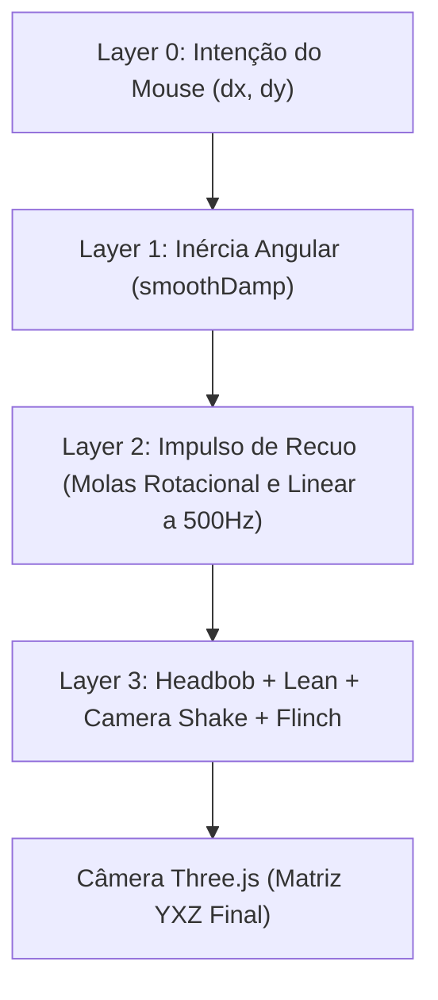

# 🏛️ Guia Definitivo de Arquitetura, Funcionamento Interno & Migração Data-Driven

> **Objetivo Deste Documento:**
> 1. Mapear **onde** cada feature do jogo está localizada no código-fonte (`src/` e `assets/`).
> 2. Explicar **como** cada subsistema funciona por dentro (fluxo lógico, física, matemática e ciclo de vida).
> 3. Ensinar a filosofia e o processo prático de **migração para Data-Driven**, demonstrando como desacoplar números mágicos do código para que qualquer aspecto do jogo (ex: **aumentar ou diminuir o headbob em 20%**, alterar recuo, velocidade ou IA) possa ser modificado exclusivamente via arquivos `.json`, sem tocar em uma única linha de código e sem risco de quebrar o jogo.

---

## 🗺️ SEÇÃO 1: Onde as Features Estão e Como Funcionam

A arquitetura do **Arena Blockout Limited** é dividida em camadas rígidas de responsabilidade:

```text
[assets/]  Camada de Dados (JSONs puros: gameplay, armas, munições, áudio, bots, mapas)
    │
    ▼
[src/core/ConfigLoader.js]  Validação defensiva e injeção de fallbacks em memória
    │
    ▼
[fixedUpdate (120Hz)] ──────► Física Pura, Colisão AABB, Balística CCD, FSM dos Bots
    │
    ▼
[renderUpdate (rAF)]  ──────► Interpolação, CameraRig, Viewmodel Sway, VFX e Renderização
```

Abaixo está o detalhamento minucioso de cada componente.

---

### 1.1. Câmera, Cinemática & Físico da Cabeça
* **Arquivo:** [`src/core/CameraRig.js`](file:///c:/Users/Mateus/Desktop/Projetos/FPS%20BROWSER/deepseek/fps%20blocky/src/core/CameraRig.js)
* **Classe:** `CameraRig`

#### Como Funciona por Dentro:
O `CameraRig` não aplica o mouse diretamente na câmera do Three.js. Ele divide a cinemática da visão em **4 Camadas Físicas**:



1. **Layer 0 (Intenção do Operador):**
   O método `addMouseInput(dx, dy, sens)` atualiza `targetYaw` e `targetPitch`, limitando a inclinação vertical em `pitchLimit` ($\pm 1.52\text{ rad} \approx \pm 87^\circ$).
2. **Layer 1 (Inércia da Cabeça - Turning Rate):**
   Utiliza um algoritmo de amortecimento analítico crítico (`smoothDamp`). A rotação da câmera não teleporta: ela persegue o alvo com uma mola sem overshoot. O peso da arma equipada (`weaponWeight`) amplifica o tempo de resposta (`smoothTime`), tornando armas pesadas (como a M249) mais lentas para girar no ADS.
3. **Layer 2 (Molas de Recuo e Coice no Ombro):**
   Possui um laço de **sub-stepping analítico a 500 Hz** (`remainDt -= 0.002s`) resolvendo as equações de mola amortecida de Hooke:
   $$\vec{a}_{\text{recoil}} = -k \cdot \vec{x} - c \cdot \vec{v}$$
   Onde $k_{\text{rot}} = 280$ e $c_{\text{rot}} = 25$ absorvem o tranco da arma no ombro do operador em rotação e profundidade ($Z$).
4. **Layer 3 (Headbob, Lean e Tranco de Dano):**
   * **Headbob:** Calculado em função da velocidade horizontal $\sqrt{v_x^2 + v_z^2}$. Gera uma figura em formato de "oito" infinito na visão:
     $$bobY = \sin(\text{phase} \cdot 2) \cdot \text{amt}$$
     $$bobX = \cos(\text{phase}) \cdot \text{amt} \cdot 0.60$$
   * **Lean Tático:** As teclas `Q` e `E` movem a cabeça 35 cm lateralmente (`leanOffsetDist`) com 5 cm de rebaixamento natural (`leanDrop`) e inclinação angular de roll ($-7.5^\circ$).
   * **Flinch:** Ao tomar tiros, sofre um tranco angular brusco que decai exponencialmente a $15\text{ s}^{-1}$.

---

### 1.2. Viewmodel, Sway & Animação Orgânica da Arma
* **Arquivo:** [`src/weapons/Viewmodel.js`](file:///c:/Users/Mateus/Desktop/Projetos/FPS%20BROWSER/deepseek/fps%20blocky/src/weapons/Viewmodel.js)
* **Classe:** `Viewmodel`

#### Como Funciona por Dentro:
* **Spring-Damper Sway (Inércia do Cano):**
  Lê a velocidade angular limpa da cabeça (`rig.angularVelocity`). Ao virar a câmera para a direita, a arma sofre um atraso elástico para a esquerda, rotacionando em torno do punho com rigidez de mola (`springStiffness: 25.0`) e amortecimento (`springDamping: 8.0`).
* **Lissajous Breathing Curve (Respiração no ADS):**
  A arma nunca fica perfeitamente imóvel. Quando em mira de ferro ou luneta, a ponta do cano traça uma curva de Lissajous baseada no tempo $t$, simulando o pulso e respiração do atirador:
  $$x_{\text{sway}} = \sin(t \cdot 1.2) \cdot \text{amplitude}$$
  $$y_{\text{sway}} = \sin(t \cdot 2.4) \cdot \text{amplitude} \cdot 0.5$$
* **Kickback Físico:**
  No momento do disparo, a malha da arma é empurrada para trás no eixo local $Z$ (`kickbackZ`) e eleva o cano antes de retornar ao repouso.

---

### 1.3. Locomoção do Jogador & Corpo Físico
* **Arquivo:** [`src/entities/Player.js`](file:///c:/Users/Mateus/Desktop/Projetos/FPS%20BROWSER/deepseek/fps%20blocky/src/entities/Player.js) (herda de [`src/entities/Character.js`](file:///c:/Users/Mateus/Desktop/Projetos/FPS%20BROWSER/deepseek/fps%20blocky/src/entities/Character.js))
* **Classe:** `Player`

#### Como Funciona por Dentro:
* **Vetor de Desejo ($\vec{w}_{\text{wish}}$):** Converte as entradas de teclado (`move_forward`, `move_back`, etc.) em vetores orientados pelo ângulo de visão horizontal ($\text{Yaw}$).
* **Penalidade de Strafe Lateral:** Se o vetor de movimento contém componente lateral (strafe), a velocidade máxima é atenuada, recompensando o avanço tático e punindo movimentação errática.
* **Aceleração e Atrito:**
  A velocidade não muda instantaneamente. No chão, acelera com $40\text{ m/s}^2$ (`accel`) e sofre atrito de $22\text{ s}^{-1}$ (`friction`). No ar, a aceleração cai para $6\text{ m/s}^2$ (`airAccel`), preservando o momento do pulo.
* **Integração Física (`moveAndSlide`):**
  Chama o motor de colisão aplicando gravidade ($20\text{ m/s}^2$) e resolução de caixas sólidas com suporte a subir degraus (`stepHeight: 0.55m`).

---

### 1.4. Motor de Colisão Espacial (AABB & Spatial Hash Grid)
* **Arquivo:** [`src/physics/CollisionWorld.js`](file:///c:/Users/Mateus/Desktop/Projetos/FPS%20BROWSER/deepseek/fps%20blocky/src/physics/CollisionWorld.js)
* **Classe:** `CollisionWorld`

#### Como Funciona por Dentro:
* **Spatial Hash Grid:** O mundo 3D é dividido em células quadradas de $4.0\text{ m} \times 4.0\text{ m}$. Cada parede ou caixa de colisão é indexada apenas nas células que intercepta.
* **Busca em $O(1)$:** Ao calcular o movimento do jogador ou o traçado de uma bala, o motor não varre todos os blocos do mapa; ele calcula as coordenadas da célula e testa apenas os candidatos imediatos.
* **Algoritmo de Slabs (Raycast AABB Puro):** Raycasting matemático analítico que calcula a interseção do raio com os planos mínimos e máximos da caixa $(X, Y, Z)$ sem depender de geometrias Three.js ou da GPU.
* **Suporte a Triggers:** Suporta caixas com flag `solid: false` e `isTrigger: true`, usadas para detectar drops de armas e portas sem bloquear a passagem.

---

### 1.5. Balística Avançada & Simulação Contínua (CCD)
* **Arquivos:**
  * [`src/weapons/BallisticsCalculator.js`](file:///c:/Users/Mateus/Desktop/Projetos/FPS%20BROWSER/deepseek/fps%20blocky/src/weapons/BallisticsCalculator.js)
  * [`src/weapons/ProjectileManager.js`](file:///c:/Users/Mateus/Desktop/Projetos/FPS%20BROWSER/deepseek/fps%20blocky/src/weapons/ProjectileManager.js)
  * [`assets/weapons/weapons.json`](file:///c:/Users/Mateus/Desktop/Projetos/FPS%20BROWSER/deepseek/fps%20blocky/assets/weapons/weapons.json)
  * [`assets/weapons/ammo.json`](file:///c:/Users/Mateus/Desktop/Projetos/FPS%20BROWSER/deepseek/fps%20blocky/assets/weapons/ammo.json)

#### Como Funciona por Dentro:
* **Dispersão Dinâmica:**
  O método `calculateCurrentSpread` compõe o desvio angular (em radianos) somando:
  $$\text{Spread} = \text{baseSpread} + \text{dynamicLoss(walk/run/strafe)} + \text{streakPenalty}$$
  Com uma taxa de recuperação suave (`recoveryTime`).
* **Continuous Collision Detection (CCD Sweep):**
  Em vez de raycasts instantâneos (hitscan), o `ProjectileManager` instancia projéteis físicos em um Object Pool pré-alocado. Em cada tick de 120Hz:
  1. O projétil calcula sua nova posição: $\vec{P}_{t+1} = \vec{P}_t + \vec{v} \cdot dt + \frac{1}{2}\vec{g} \cdot dt^2$.
  2. Traça um segmento de reta entre $\vec{P}_t$ e $\vec{P}_{t+1}$ contra o `CollisionWorld` e as hitboxes de bots e jogador.
  3. Previne 100% o fenômeno de "tunneling" (balas que atravessam alvos em movimento veloz entre dois quadros).
* **Atraso Acústico Sônico:**
  Quando o projétil atinge um alvo a longa distância, o impacto emite o evento `shot:bot` com `soundDelay = dist / 343.0`. O `AudioSystem` aguarda esse intervalo para tocar o som de impacto no ouvido do jogador.

---

### 1.6. Inteligência Artificial (FSM dos Bots)
* **Arquivos:**
  * [`src/ai/AIController.js`](file:///c:/Users/Mateus/Desktop/Projetos/FPS%20BROWSER/deepseek/fps%20blocky/src/ai/AIController.js)
  * [`src/ai/states/PatrolState.js`](file:///c:/Users/Mateus/Desktop/Projetos/FPS%20BROWSER/deepseek/fps%20blocky/src/ai/states/PatrolState.js)
  * [`src/ai/states/EngageState.js`](file:///c:/Users/Mateus/Desktop/Projetos/FPS%20BROWSER/deepseek/fps%20blocky/src/ai/states/EngageState.js)
  * [`src/ai/states/SearchState.js`](file:///c:/Users/Mateus/Desktop/Projetos/FPS%20BROWSER/deepseek/fps%20blocky/src/ai/states/SearchState.js)
  * [`src/ai/states/FleeState.js`](file:///c:/Users/Mateus/Desktop/Projetos/FPS%20BROWSER/deepseek/fps%20blocky/src/ai/states/FleeState.js)

#### Como Funciona por Dentro:
* **FSM Desacoplada:** Cada estado é uma classe com métodos `enter()`, `update()` e `exit()`.
* **Audição de Tiros:** O `AIController` escuta o evento global `weapon:fired`. Se o bot estiver em patrulha e o disparo ocorreu a menos de 35 metros, ele muda imediatamente para `SearchState` e corre até o local de onde o som partiu.
* **Comportamento de Fuga (Flee):** Se o HP do bot cair para menos de 30% em combate, ele rompe o engajamento e corre na direção oposta ao jogador em busca de cobertura.
* **Burst Fire & Precisão Real:** A IA dispara em rajadas controladas com dispersão angular imperfeita calibrada por distância via `bots.json`.
* **Desacoplamento Visual (`CharacterView.js`):** A entidade `Bot` não contém geometrias do Three.js. Toda a representação visual (tronco, cabeça, braços e materiais) reside em `CharacterView`, garantindo que o bot possa rodar em modo *Headless* no servidor.

---

### 1.7. Loot 3D & Inventário de 2 Armas
* **Arquivos:**
  * [`src/world/ItemDrop.js`](file:///c:/Users/Mateus/Desktop/Projetos/FPS%20BROWSER/deepseek/fps%20blocky/src/world/ItemDrop.js)
  * [`src/weapons/WeaponSystem.js`](file:///c:/Users/Mateus/Desktop/Projetos/FPS%20BROWSER/deepseek/fps%20blocky/src/weapons/WeaponSystem.js)
  * [`src/core/GameManager.js`](file:///c:/Users/Mateus/Desktop/Projetos/FPS%20BROWSER/deepseek/fps%20blocky/src/core/GameManager.js)

#### Como Funciona por Dentro:
* Ao morrer, o bot ou o jogador solta a arma atual instanciando um `ItemDrop`.
* O `ItemDrop` clona a geometria 3D da arma a partir dos construtores procedurais, adiciona um disco de luz colorido por categoria e oscila com flutuação senoidal suave ($\text{rotation.y} \mathrel{+}= dt \cdot 1.5$).
* Se o jogador se aproxima de um drop com a mesma arma, reabastece munição automaticamente.
* Se for uma arma diferente e o jogador pressionar `F` (ou o botão de interação contextual no mobile), o sistema coloca a nova arma no slot ativo e dropa a arma anterior no chão.

---

### 1.8. Áudio 100% Sintetizado (Web Audio API)
* **Arquivo:** [`src/audio/AudioSystem.js`](file:///c:/Users/Mateus/Desktop/Projetos/FPS%20BROWSER/deepseek/fps%20blocky/src/audio/AudioSystem.js)
* **Dados:** [`assets/config/audio.json`](file:///c:/Users/Mateus/Desktop/Projetos/FPS%20BROWSER/deepseek/fps%20blocky/assets/config/audio.json)

#### Como Funciona por Dentro:
* Sem arquivos MP3/WAV baixados pela rede. O motor instancia nós da `Web Audio API`:
  * `OscillatorNode` (senoidais, dente-de-serra, quadradas).
  * `AudioBufferSourceNode` com ruído branco sintético estocástico (`noiseBuffer`).
  * `BiquadFilterNode` (filtros passa-baixa e passa-faixa com ressonância $Q$).
  * `StereoPannerNode` para posicionamento estéreo direcional.
* Exemplo da S&W 500 Magnum: Combina uma onda de choque de ruído filtrado a 3200Hz decaindo para 160Hz + um oscilador sub-bass em rampa de $130\text{ Hz} \rightarrow 25\text{ Hz}$ + um estalo dente-de-serra em $280\text{ Hz}$.

---

### 1.9. Efeitos Visuais (VFX) & FlashTracers
* **Arquivo:** [`src/fx/Effects.js`](file:///c:/Users/Mateus/Desktop/Projetos/FPS%20BROWSER/deepseek/fps%20blocky/src/fx/Effects.js)

#### Como Funciona por Dentro:
* **FlashTracers Estilo CS2:**
  Em vez de traçantes lentos que parecem "lasers espaciais", o jogo usa o modelo fotográfico: o traçante dura de $0.03\text{s}$ a $0.06\text{s}$ com filamento central incandescente e halo difuso.
* **Dynamic Muzzle Tracking:**
  O método `originTracker` rastreia a posição real do cano da arma no espaço de mundo frame a frame. Enquanto o projétil emerge, o início do traçante fica cravado na boca da arma, evitando o defeito visual de a bala parecer flutuar longe da arma durante strafes rápidos.

---

## 💡 SEÇÃO 2: Por Que Migrar Para Data-Driven?

### O Problema do Código Monolítico com "Números Mágicos"
Em um código imperativo tradicional, as regras e constantes de física ficam espalhadas dentro dos arquivos JavaScript:
```javascript
// CÓDIGO PROBLEMÁTICO (HARDCODED)
const target = (player.sprinting ? 0.040 : 0.029) * Math.min(speedXZ / 5.2, 1.8);
this.bobAmt += (target - this.bobAmt) * Math.min(dt * 8, 1);
```
**Quais os riscos graves disso?**
1. **Risco de Regressão e Quebra:** Para diminuir o balanço da cabeça em 20%, um designer precisa abrir `CameraRig.js`, alterar a matemática interna e arriscar quebrar imports, sintaxe ou lógica.
2. **Ciclo de Teste Lento:** Toda alteração exige editar código-fonte.
3. **Bloqueio de Modding:** Modders da comunidade não conseguem balancear o jogo sem acesso ao código-fonte.
4. **Impossibilidade de Porte Automatizado para Godot:** Na Godot, nós e recursos usam arquivos `.tres` ou dicionários JSON. Se os números estiverem embutidos nos scripts, o porte requer reescrever tudo na mão.

### A Filosofia Data-Driven
No modelo **Data-Driven (Guiado por Dados)**:
* O código é apenas o **motor/executor matemático agnóstico**.
* Todos os parâmetros residem em **arquivos JSON estruturados**.
* O motor inicia, lê os arquivos de dados via [`ConfigLoader.js`](file:///c:/Users/Mateus/Desktop/Projetos/FPS%20BROWSER/deepseek/fps%20blocky/src/core/ConfigLoader.js) e preenche os cálculos.
* Se um modder errar uma vírgula ou apagar uma propriedade, o **Deep Merge com Fallbacks de Segurança** preenche os valores faltantes com números seguros sem interromper a execução.

---

## 🔍 SEÇÃO 3: Mapeamento de Números Hardcoded Remanescentes

Apesar de a maior parte do jogo já ser Data-Driven (`weapons.json`, `ammo.json`, `bots.json`, `range.json`), ainda identificamos constantes hardcoded em pontos do código que devem ser migradas:

| Arquivo | Parâmetro Hardcoded Atual | Onde Deveria Estar |
| :--- | :--- | :--- |
| [`CameraRig.js`](file:///c:/Users/Mateus/Desktop/Projetos/FPS%20BROWSER/deepseek/fps%20blocky/src/core/CameraRig.js#L316) | Amplitudes do Headbob (`0.029` caminhada, `0.040` corrida) e frequências (`9 + 5`) | `assets/config/gameplay.json` (`camera.headbob`) |
| [`CameraRig.js`](file:///c:/Users/Mateus/Desktop/Projetos/FPS%20BROWSER/deepseek/fps%20blocky/src/core/CameraRig.js#L306) | Taxa de decaimento do Flinch (`dt * 15`) e Shake (`dt * 9`) | `assets/config/gameplay.json` (`camera.flinchDecay`) |
| [`CameraRig.js`](file:///c:/Users/Mateus/Desktop/Projetos/FPS%20BROWSER/deepseek/fps%20blocky/src/core/CameraRig.js#L339) | Distância de deslocamento do Lean (`0.35m`) e inclinação de Roll (`0.13 rad`) | `assets/config/gameplay.json` (`player.lean`) |
| [`Player.js`](file:///c:/Users/Mateus/Desktop/Projetos/FPS%20BROWSER/deepseek/fps%20blocky/src/entities/Player.js#L149) | Multiplicador de velocidade no ADS e agachado (`0.5`) | `assets/config/gameplay.json` (`player.crouchMultiplier`) |
| [`GameManager.js`](file:///c:/Users/Mateus/Desktop/Projetos/FPS%20BROWSER/deepseek/fps%20blocky/src/core/GameManager.js#L91) | Limite máximo de drops simultâneos de armas no chão (`MAX_DROPS = 2`) | `assets/config/gameplay.json` (`world.maxItemDrops`) |
| [`Door.js`](file:///c:/Users/Mateus/Desktop/Projetos/FPS%20BROWSER/deepseek/fps%20blocky/src/world/Door.js) | Raio de interação da porta (`interactRange = 2.5m`) | `assets/maps/*.json` (propriedade por porta) |

---

## 🛠️ SEÇÃO 4: Guia Prático Passo a Passo de Migração

### 🎯 CASO DE ESTUDO 1: Ajustar o Headbob em $\pm 20\%$ via JSON

Vamos resolver o caso exato citado: **como migrar o Headbob para que você possa diminuir ou aumentar seu efeito em 20% apenas alterando um arquivo `.json`**.

#### Passo 1: Definir o Esquema no `gameplay.json`
Abra [`assets/config/gameplay.json`](file:///c:/Users/Mateus/Desktop/Projetos/FPS%20BROWSER/deepseek/fps%20blocky/assets/config/gameplay.json) e adicione o bloco `headbob` dentro de `camera`:

```json
{
  "camera": {
    "hipFov": 78.0,
    "adsFov": 55.0,
    "sensitivity": 0.0022,
    "adsSensitivityMultiplier": 0.55,
    "pitchLimit": 1.52,
    "headbob": {
      "walkAmplitude": 0.029,
      "sprintAmplitude": 0.040,
      "frequencyRate": 9.0,
      "sprintFrequencyBoost": 5.0,
      "rollMultiplier": 0.16,
      "pitchMultiplier": 0.07,
      "intensityScale": 1.0
    }
  }
}
```

> 💡 **Para diminuir 20%:** basta mudar `"intensityScale": 0.8`.
> 💡 **Para aumentar 20%:** basta mudar `"intensityScale": 1.2`.

---

#### Passo 2: Atualizar os Fallbacks de Segurança em `ConfigLoader.js`
No arquivo [`src/core/ConfigLoader.js`](file:///c:/Users/Mateus/Desktop/Projetos/FPS%20BROWSER/deepseek/fps%20blocky/src/core/ConfigLoader.js), adicionamos os valores seguros no `DEFAULT_CONFIG`:

```javascript
export const DEFAULT_CONFIG = {
  // ...
  CAMERA: {
    hipFov: 78.0,
    adsFov: 55.0,
    sens: 0.0022,
    adsSensMul: 0.55,
    pitchLimit: 1.52,
    smoothTime: 0.016,
    adsSmoothTime: 0.024,
    maxTurningRate: 50.0,
    // NOVO BLOCO DATA-DRIVEN DE HEADBOB:
    headbob: {
      walkAmplitude: 0.029,
      sprintAmplitude: 0.040,
      frequencyRate: 9.0,
      sprintFrequencyBoost: 5.0,
      rollMultiplier: 0.16,
      pitchMultiplier: 0.07,
      intensityScale: 1.0
    }
  }
};
```

E no método `loadAll()`, garantimos que o `deepMerge` popule o bloco:
```javascript
if (gp.camera) {
  // ...
  if (gp.camera.headbob) {
    deepMerge(CONFIG.CAMERA.headbob, gp.camera.headbob);
  }
}
```

---

#### Passo 3: Atualizar o Código Matemático no `CameraRig.js`
Substituímos os números mágicos em [`src/core/CameraRig.js`](file:///c:/Users/Mateus/Desktop/Projetos/FPS%20BROWSER/deepseek/fps%20blocky/src/core/CameraRig.js):

**Antes (Hardcoded):**
```javascript
const rate = 9 + (player.sprinting ? 5 : 0) - player.crouchAmount * 3;
this.bobPhase += dt * rate;
const target = (player.sprinting ? 0.040 : 0.029) * Math.min(speedXZ / CONFIG.PLAYER.walkSpeed, 1.8);
this.bobAmt += (target - this.bobAmt) * Math.min(dt * 8, 1);

const bobY = Math.sin(this.bobPhase * 2) * this.bobAmt;
const bobX = Math.cos(this.bobPhase) * this.bobAmt * 0.60;
this.bobRoll = Math.cos(this.bobPhase) * this.bobAmt * 0.16;
this.bobPitch = Math.sin(this.bobPhase * 2) * this.bobAmt * 0.07;
```

**Depois (100% Data-Driven):**
```javascript
const cfg = CONFIG.CAMERA.headbob;
const scale = cfg.intensityScale ?? 1.0;

const rate = (cfg.frequencyRate + (player.sprinting ? cfg.sprintFrequencyBoost : 0) - player.crouchAmount * 3);
this.bobPhase += dt * rate;

const baseAmp = player.sprinting ? cfg.sprintAmplitude : cfg.walkAmplitude;
const target = (baseAmp * scale) * Math.min(speedXZ / CONFIG.PLAYER.walkSpeed, 1.8);
this.bobAmt += (target - this.bobAmt) * Math.min(dt * 8, 1);

const bobY = Math.sin(this.bobPhase * 2) * this.bobAmt;
const bobX = Math.cos(this.bobPhase) * this.bobAmt * 0.60;
this.bobRoll = Math.cos(this.bobPhase) * this.bobAmt * cfg.rollMultiplier;
this.bobPitch = Math.sin(this.bobPhase * 2) * this.bobAmt * cfg.pitchMultiplier;
```

Pronto! Agora qualquer desenvolvedor ou jogador pode calibrar a sensação cinemática da cabeça sem abrir código.

---

### 🎯 CASO DE ESTUDO 2: Criando ou Balanceando Armas 100% via Dados

Para criar uma arma inédita (ex: `scar_h`) ou alterar o recuo de uma arma existente, você **não mexe em código**.

Abra [`assets/weapons/weapons.json`](file:///c:/Users/Mateus/Desktop/Projetos/FPS%20BROWSER/deepseek/fps%20blocky/assets/weapons/weapons.json):
```json
{
  "scar_h": {
    "id": "scar_h",
    "name": "SCAR-H 7.62",
    "ammo": "7.62_soviet",
    "weight": 3.7,
    "damageBody": 42,
    "damageHead": 88,
    "fireInterval": 0.10,
    "magSize": 20,
    "reloadTime": 2.1,
    "ballistics": {
      "external": {
        "recoil": {
          "vertical": 0.014,
          "horizontal": 0.0035,
          "pattern": "climb_smooth",
          "recoveryTime": 0.32
        },
        "precision": {
          "baseSpread": 0.0008,
          "dynamicLoss": { "walk": 0.02, "run": 0.05 }
        }
      }
    }
  }
}
```

O `WeaponDefs.js` compila a nova arma automaticamente, herda o traçante e velocidade balística da munição `7.62_soviet` de `ammo.json` e a injeta no catálogo de drops e bots sem nenhuma alteração em JavaScript.

---

### 🎯 CASO DE ESTUDO 3: Calibrando Dificuldade dos Bots via Dados

Abra [`assets/characters/bots.json`](file:///c:/Users/Mateus/Desktop/Projetos/FPS%20BROWSER/deepseek/fps%20blocky/assets/characters/bots.json):
```json
{
  "viewRange": 32.0,
  "reactionTime": 0.15,
  "hitAccuracyBase": 0.12,
  "hitAccuracyMax": 0.65,
  "hitAccuracyRange": 30.0,
  "respawnTime": 3.0
}
```
* Quer bots mais desafiadores para teste de mira? Reduza `reactionTime` para `0.10` e aumente `hitAccuracyMax` para `0.75`.
* Quer bots mais lentos para iniciantes? Aumente `reactionTime` para `0.35` e reduza a precisão máxima.

---

## 📐 SEÇÃO 5: Boas Práticas e Regras de Ouro de Arquitetura

1. **Unidades de Medida Padronizadas:**
   * Distâncias sempre em **metros** (m).
   * Tempos sempre em **segundos** (s).
   * Velocidades sempre em **metros por segundo** (m/s).
   * Ângulos sempre em **radianos** (rad) no código ou **graus** explicitamente documentados no JSON.
   * Massa sempre em **quilogramas** (kg).
2. **Defesa em Profundidade com Operador Nullish (`??`):**
   Nunca acesse propriedades profundas sem fallback:
   ```javascript
   // CORRETO:
   const recoilMul = wep.ballistics?.external?.recoil?.vertical ?? 0.01;
   ```
3. **Imutabilidade em Execução:**
   Arquivos JSON definem parâmetros estáticos iniciais. Nunca modifique o objeto `CONFIG` original durante o loop para evitar efeitos colaterais persistentes entre reinicializações de partidas.
